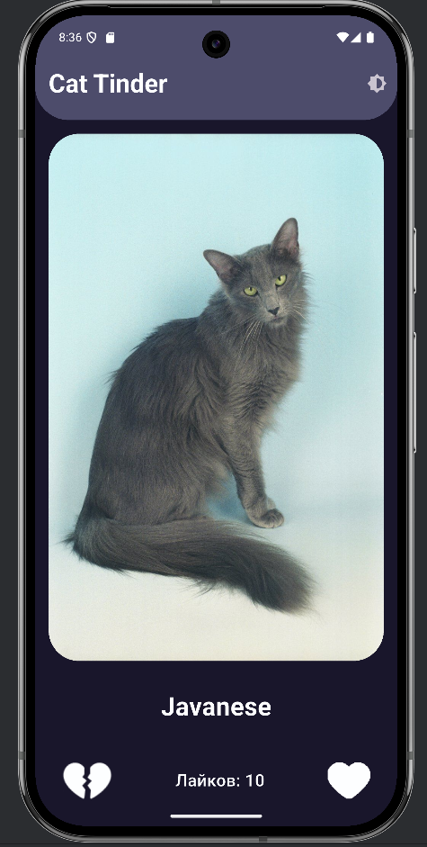
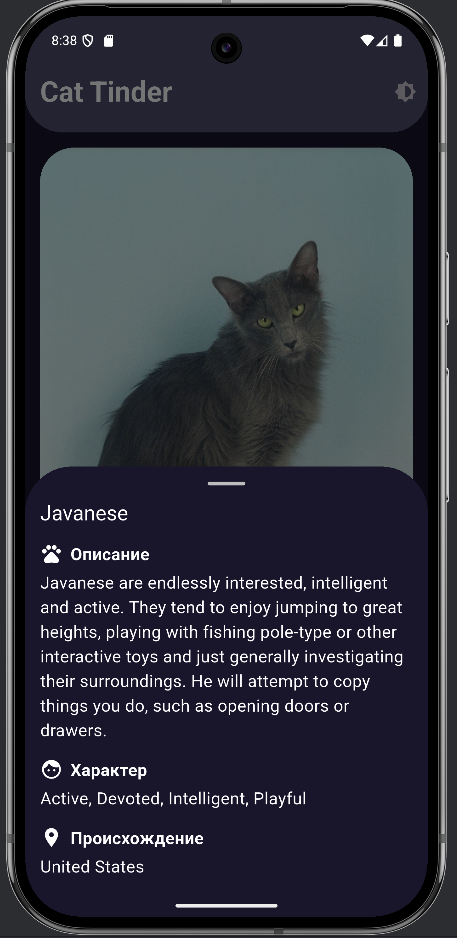

# Cat Tinder

## Описание

Этот проект представляет собой приложение для знакомства с котами.  
Пользователь может просматривать список котов, ставить лайки и дизлайки, а также просматривать детальную информацию о каждом коте.

## Скриншоты

### Главный экран


### Экран деталей
  


## Функциональность

- Загрузка списка котов с сервера
- Просмотр информации о каждом коте
- Кнопки лайка и дизлайка
- Свайпы влево и вправо, равносильные лайку и дизлайку соответственно
- Счетчик понравившихся котов
- Изменение темы

## Технологии
- Flutter 3.7+
- Dart 3.0+
- [TheCatAPI](https://thecatapi.com/)
- CachedNetworkImage

## Используемые пакеты

- [`cupertino_icons`](https://pub.dev/packages/cupertino_icons) — иконки в стиле iOS
- [`http`](https://pub.dev/packages/http) — выполнение HTTP-запросов
- [`cached_network_image`](https://pub.dev/packages/cached_network_image) — загрузка и кэширование изображений
- [`provider`](https://pub.dev/packages/provider) — управление состоянием

## Структура проекта

```
lib/
 ├── main.dart                  # Точка входа
 ├── controllers/
 │    ├── cat_controller.dart   # Логика управления котами
 ├── models/
 │    ├── cat.dart              # Модель данных кота
 ├── screens/
 │    ├── main_screen.dart      # Главный экран
 │    ├── detail_screen.dart    # Экран с деталями кота
 ├── services/
 │    ├── cat_service.dart      # Получение данных с сервера
 ├── themes/
 │    ├── app_theme.dart        # Темы приложения
 ├── widgets/
 │    ├── cat_card.dart         # Карточка кота
 │    ├── like_button.dart      # Кнопка лайка
 │    ├── dislike_button.dart   # Кнопка дизлайка
 │    ├── loading_indicator.dart # Индикатор загрузки
 │    ├── error_placeholder.dart # Заглушка для ошибок
 │── pubspec.yaml 
 │── analysis_options.yaml 
```


## Ссылка на скачивание APK
[Скачать APK](https://drive.google.com/file/d/14s_Kvzkvtjp2HzzYKwpFEHgl4wOcdBiI/view?usp=drive_link)
